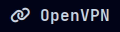
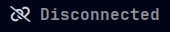

# OpenVPN Module 
A custom Polybar module which  displays the OpenVPN status.

 

This module requires `ttf-font-awesome` version `>=3.1.0` for the connection icons. These can be changed to other icons of preference.

## Configuration
There are two ways of configuring OpenVPN to be used with this module:
##### Using `openvpn` CLI
Place desired `.ovpn` file into a directory and launch OpenVPN with the following command:
 ```shell
 openvpn --daemon --auth-nocache --cd "<DIRECTORY>" --config "<PROFILE>.ovpn"
 ```
##### Using `networkmanager-openvpn`
If you're using NetworkManager, install the `networkmanager-openvpn` package. Then activate the connection in `nmtui`.

 ## Module
 ```ini
 [module/openvpn]
type = custom/script
exec = <PATH TO SCRIPT>
interval = 5
 ```

